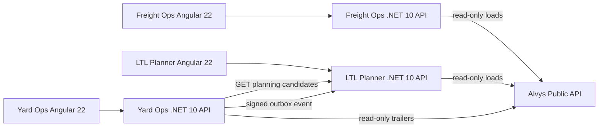

# Architecture

## Boundaries

### Freight Ops

Owns customer/account workflow and commercial prioritization. It consumes external load visibility but never treats the third-party transport system as its own database.

### LTL Planner

Owns internal shipment planning, capacity validation, and explainable assignment results. It exposes a narrow integration contract for Yard rather than sharing tables or domain entities.

### Yard Ops

Owns physical yard state, gate/dock actions, and inspection readiness. It knows only LTL's published integration contract and an HMAC signing secret; it does not reference LTL implementation classes.

## Integration style

Yard -> LTL demonstrates two patterns deliberately:

- synchronous HTTP for a human waiting on candidate data;
- asynchronous signed event delivery for state-change notification.

The outbox is in-memory in this portfolio build to keep the demo self-contained. In production the same `IOutboxStore` boundary could be backed by SQL and drained by one or more workers.

## Failure behavior

- External Alvys calls have bounded timeouts/resilience and surface degraded state instead of fabricating data.
- Yard candidate lookup reports LTL unavailability explicitly.
- Yard events remain pending in the outbox and retry with bounded exponential backoff after transient LTL failures.
- LTL event ingestion is idempotent by `eventId`.

## Contract evolution

The Yard/LTL service contract is exposed under `/api/integrations/v1/` and integration events carry `schemaVersion: 1`. LTL rejects unknown schema versions at its edge, keeping version negotiation out of domain logic.
